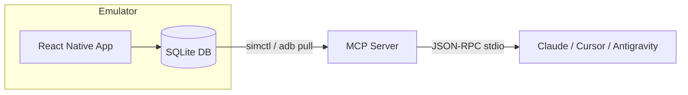

<div align="center">

# react-native-sqlite-mcp

Expose your React Native SQLite database to MCP-compatible tooling — with emulator support.

<br />


<br />


</div>

---

## Overview

SQLite MCP servers exist, but they all assume your database is a file sitting on your desktop or server. They open a path, read the file, done.

That doesn't work for mobile. On iOS Simulator, SQLite databases are buried deep inside sandboxed app containers. On Android Emulator, they're behind `run-as` permission boundaries that require `adb` to access. No existing SQLite MCP server handles either of these.

I built this because I was tired of manually extracting `.db` files from emulators just to figure out why my app's local state was wrong.

`react-native-sqlite-mcp` is a SQLite MCP server purpose-built for mobile emulators. It auto-discovers databases inside iOS Simulator and Android Emulator sandboxes, pulls them transparently, and exposes schema + query access to any MCP-compatible tool.

---

## Why This Exists

- Existing SQLite MCP servers can't reach databases inside iOS Simulator or Android Emulator sandboxes
- Mobile MCP tooling focuses on UI automation, not the data layer
- SQLite-backed state is critical in local-first React Native apps
- There was no MCP bridge for inspecting emulator databases directly from your AI tooling

This project fills that gap.

---

## How It Works



1. Auto-detects booted iOS Simulators (`xcrun simctl`) and Android Emulators (`adb`)
2. Discovers SQLite databases inside sandboxed app containers
3. Pulls database files transparently (iOS reads in-place, Android uses `run-as` + `adb pull`)
4. Exposes schema and query access over the MCP stdio transport

---

## Quick Start

Add this to your MCP config (`mcp.json`, `.cursor/mcp.json`, or `.gemini/settings.json`):

```json
{
  "mcpServers": {
    "rn-sqlite-bridge": {
      "command": "npx",
      "args": ["-y", "react-native-sqlite-mcp"],
      "env": {
        "DB_NAME": "my_app.db",
        "ANDROID_BUNDLE_ID": "com.mycompany.myapp"
      }
    }
  }
}
```

Restart your editor. Your AI can now query your emulator databases directly.

---

## Environment Variables

| Variable | Required | Description |
|---|---|---|
| `DB_NAME` | No | Database filename to auto-sync on startup (e.g. `my_app.db`). Supports glob patterns (`*.db`). If omitted, auto-selects the first discovered database. |
| `ANDROID_BUNDLE_ID` | No | Android app package name (e.g. `com.mycompany.app`). If omitted, scans all third-party packages on the emulator. |
| `READ_ONLY` | No | Set to `true` to restrict `query_db` to SELECT, PRAGMA, and EXPLAIN statements only. Default: `false`. |
| `MCP_LOG_LEVEL` | No | Log verbosity: `debug`, `info`, `warn`, `error`. Default: `info`. Logs go to stderr only. |

---

## Tools

### `list_databases`

Scans for all SQLite databases on booted emulators/simulators.

| Argument | Type | Description |
|---|---|---|
| `platform` | string | Optional. `ios` or `android`. If omitted, scans both. |
| `bundleId` | string | Optional. Android-only app package name to narrow the search. |

### `sync_database`

Pulls a fresh copy of the database from the emulator so all subsequent queries use the latest data.

| Argument | Type | Description |
|---|---|---|
| `dbName` | string | Optional. Database filename or glob pattern. Auto-selects if omitted. |
| `bundleId` | string | Optional. Android-only app package name. |
| `platform` | string | Optional. `ios` or `android`. |

### `inspect_schema`

Returns all tables, columns, and `CREATE TABLE` statements for the synced database.

| Argument | Type | Description |
|---|---|---|
| `dbName` | string | Optional. Target a specific database. |
| `platform` | string | Optional. `ios` or `android`. |

### `read_table_contents`

Returns rows from a table (`SELECT * FROM table LIMIT n`).

| Argument | Type | Description |
|---|---|---|
| `tableName` | string | **Required.** The table to read. |
| `limit` | number | Optional. Max rows to return. Default: `100`. |
| `dbName` | string | Optional. Target a specific database. |
| `platform` | string | Optional. `ios` or `android`. |

### `query_db`

Executes a raw SQL query and returns the result set.

| Argument | Type | Description |
|---|---|---|
| `sql` | string | **Required.** The SQL statement to execute. |
| `params` | array | Optional. Bind parameters for `?` placeholders. |
| `dbName` | string | Optional. Target a specific database. |
| `platform` | string | Optional. `ios` or `android`. |

> When `READ_ONLY=true`, only `SELECT`, `PRAGMA`, and `EXPLAIN` statements are allowed.

---

## Manual Installation

```bash
git clone https://github.com/MisterMur/react-native-sqlite-mcp.git
cd react-native-sqlite-mcp
npm install
npm run build
```

Point your MCP config at the local build:

```json
{
  "mcpServers": {
    "rn-sqlite-bridge": {
      "command": "node",
      "args": ["/absolute/path/to/react-native-sqlite-mcp/dist/index.js"],
      "env": {
        "DB_NAME": "my_app.db"
      }
    }
  }
}
```

---

## Limitations

- Development environments only — not designed for production
- iOS requires a booted Simulator with `xcrun simctl`
- Android requires a booted Emulator with `adb` and a debuggable app (debug build)
- Queries operate on a pulled snapshot, not a live connection

---

## Contributing

Issues and pull requests are welcome.

If you're working in the local-first React Native space and hit edge cases, open an issue. This tool exists because that gap was real.

---

## License

MIT